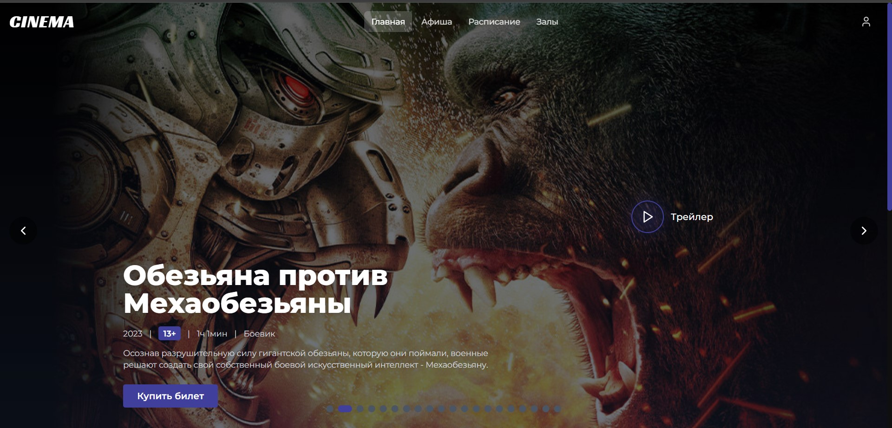
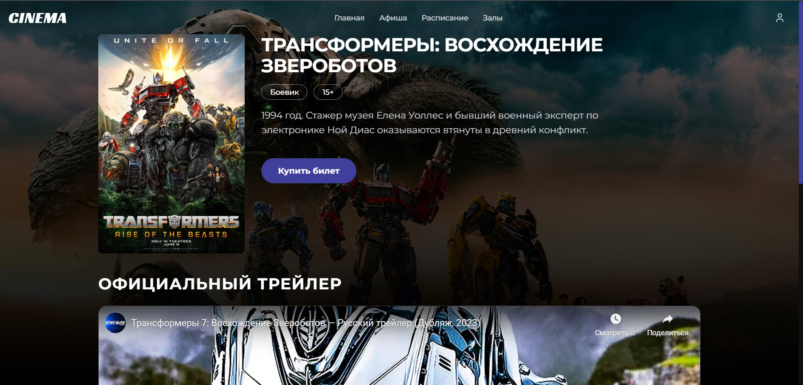
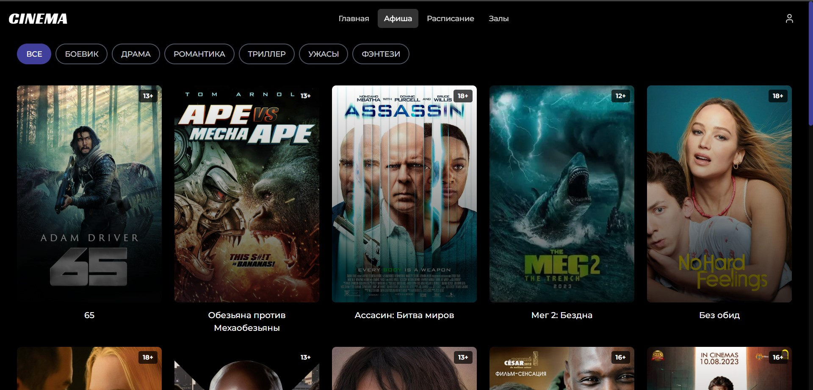
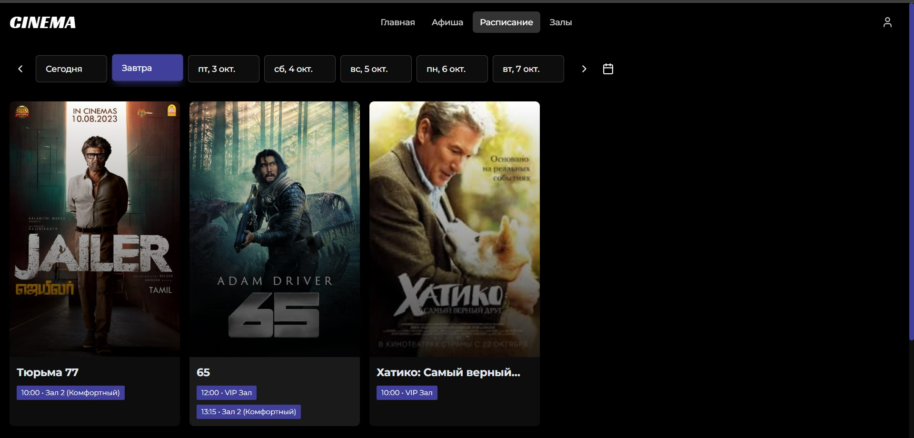
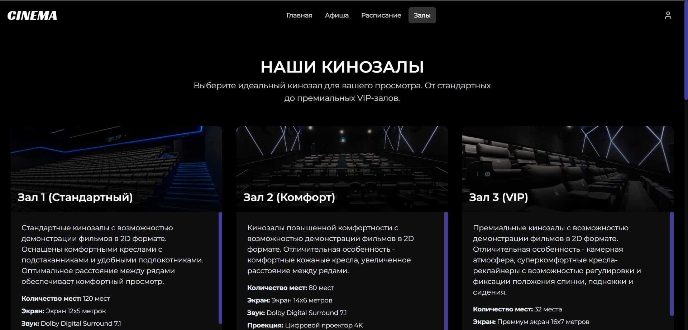

# Cinema Website

Веб-приложение для поиска фильмов и бронирования билетов в кинотеатрах.

<div align="center">

### Главная страница


### Детали фильма


### Афиша


### Расписание


### Залы

##  Функциональность

-  Просмотр афиши фильмов
-  Ознакомление с описанием фильмов и видеотрейлерами
-  Подробная информация о фильмах
-  Просмотр расписания сеансов
-  Выбор зала, времени и конкретного места
-  Бронирование билетов с указанием типа билета и места
-  Регистрация и авторизация пользователей
-  
### Frontend


### Backend


### 1. Клонирование репозитория
```bash
git clone https://github.com/lera-kabanova/website_cinema.git
cd cinema-website
# Перейти в папку бэкенда (если есть папка server)
cd server
dotnet restore
dotnet run
# Сервер запустится на http://localhost:5000
# Перейти в папку фронтенда
cd client

# Установить зависимости
npm install

# Запустить приложение
npm start

# Приложение откроется на http://localhost:3000


